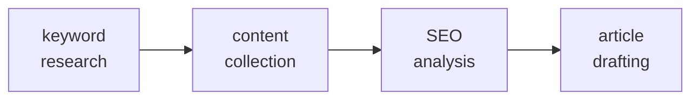

<p align="center">
  
</p>

<h1 align="center">SEO Content Pipeline</h1>

<p align="center">
  <em>4 stages. Keywords to drafts. No CMS required.</em>
</p>

<p align="center">
  
  
  
</p>

<p align="center">
  <strong>Keyword research → Competitor scraping → SEO gap analysis → 1,500+ word article drafts</strong><br>
  <sub>Runs in any AI coding agent with tool-calling. Outputs local files — zero CMS dependencies. Browser Use Cloud SDK for AI-powered article extraction; DuckDuckGo fallback for URL discovery.</sub>
</p>

---

## Pipeline



---

## Install

No bootstrap scripts, no setup commands. Each agent has a built-in path.

### Hermes Agent

Install as a plugin:

```bash
hermes plugins install attaxa/seo-pipeline --enable
```

Or load the pipeline skill in-session:

```bash
skill_view(name='seo-pipeline-llm')
```

Then in chat say *"run the SEO pipeline for [topic]"*.

Schedule as a recurring cron job:

```bash
cronjob action=create schedule="0 9 * * 1" name="weekly-seo" \
  prompt="Run the SEO content pipeline for [topic]. Execute all 4 stages." \
  skills='["seo-pipeline-llm"]'
```

### Claude Code

Reads `AGENTS.md` from the project root automatically — no setup needed.

```bash
claude AGENTS.md -- "run stage 1 keyword research for [topic]"
```

Or from an open repo session:

> *"run the SEO pipeline for [topic]"*

### Codex

Codex reads `AGENTS.md` automatically from the repo root. Clone and go:

```bash
codex
# Then: "run the SEO pipeline for [topic]"
```

### OpenCode

Configured via `opencode.json` in the repo:

```json
{ "agent": { "instructions": "AGENTS.md" } }
```

OpenCode loads pipeline instructions every session.

### Copilot CLI

Reads `.github/copilot-instructions.md` from the project root. Clone and go.

For global availability, copy the file:

```bash
cp .github/copilot-instructions.md ~/.copilot/instructions/
```

### Cursor

`.cursor/rules/seo-pipeline.mdc` ships in-repo — Cursor loads it automatically when you open the project.

For global install:

```bash
cp .cursor/rules/seo-pipeline.mdc ~/.cursor/rules/
```

### Windsurf

The repo ships `.windsurf/rules/seo-pipeline.md` — Windsurf loads it from the project root automatically.

For global install:

```bash
cp .windsurf/rules/seo-pipeline.md ~/.windsurf/rules/
```

### Cline / Aider

Clone the repo and start a session. Cline reads `.clinerules/seo-pipeline.md` from the project root. Aider reads `AGENTS.md`.

### Pi agent harness

```bash
pi install git:github.com/attaxa/seo-pipeline
```

### AGENTS.md fallback

Every agent that reads project-level `AGENTS.md` / `CLAUDE.md` / `.cursorrules` picks up the pipeline instructions automatically. Just clone the repo and start a session:

| Agent | Reads from project root |
|-------|------------------------|
| Claude Code | `AGENTS.md`, `CLAUDE.md` |
| Cursor | `.cursor/rules/`, `.cursorrules`, `AGENTS.md` |
| Windsurf | `.windsurf/rules/`, `AGENTS.md` |
| Cline | `.clinerules/`, `AGENTS.md` |
| Aider | `AGENTS.md` |
| Codex | `AGENTS.md` |
| OpenCode | `AGENTS.md`, `opencode.json` |
| Copilot CLI | `.github/copilot-instructions.md` |

### Uninstall

| Host | Command |
|------|---------|
| Hermes | Remove the skill reference from your session or cron job |
| Claude Code | Stop referencing `AGENTS.md` — or remove the file from your local clone |
| Cursor | `rm ~/.cursor/rules/seo-pipeline*` (if globally installed) |
| Windsurf | `rm ~/.windsurf/rules/seo-pipeline*` (if globally installed) |
| Any | Delete the copied rule or skill files |

---

## Configuration

| Variable | Default | Description |
|----------|---------|-------------|
| `SEO_PIPELINE_DIR` | `./pipeline_data/` | Directory for pipeline artifacts |
| `BROWSER_USE_API_KEY` | — | Browser Use Cloud API key (get one at https://cloud.browser-use.com/settings?tab=api-keys) |
| `BROWSER_USE_PROXY_COUNTRY` | `us` | Residential proxy country code (ISO 3166-1 alpha-2). Set to `none` to disable |
| `BROWSER_USE_CUSTOM_PROXY_HOST` | — | Custom proxy host. Overrides residential proxy when set |
| `BROWSER_USE_CUSTOM_PROXY_PORT` | `8080` | Custom proxy port |
| `BROWSER_USE_CUSTOM_PROXY_USERNAME` | — | Custom proxy username (optional) |
| `BROWSER_USE_CUSTOM_PROXY_PASSWORD` | — | Custom proxy password (optional) |

Set via `.env` or export. Run `python scripts/setup.py` for interactive configuration with redacted key input.

---

## Commands

| Command | What it does |
|---------|--------------|
| `python scripts/setup.py` | Interactive Browser Use setup + `.env` (redacted key input) |
| `python -m seo_pipeline --from-json keywords.json` | Scrape articles for all keywords |
| `python -m seo_pipeline "keyword"` | Scrape articles for one keyword |
| *"run the SEO pipeline for [topic]"* | In-agent: full 4-stage execution |

---

## How It Works

See [`AGENTS.md`](AGENTS.md) for the full pipeline description, quality checklist, and output structure.

---

## Requirements

- Python 3.11+
- An LLM agent with tool-calling (web search, file I/O, terminal)
- `BROWSER_USE_API_KEY` for full article extraction
- (DuckDuckGo fallback needs no API key but only discovers URLs)

---

## Agent Portability

| Agent | Config file | Setup |
|-------|------------|-------|
| Hermes | `plugin.yaml` + `__init__.py` + `skills/` + `commands/` | `hermes plugins install attaxa/seo-pipeline --enable` |
| Claude Code | `AGENTS.md` + `.claude-plugin/` | Clone repo (marketplace: `.claude-plugin/marketplace.json`) |
| Cursor | `.cursor/rules/` | Ships in-repo |
| Windsurf | `.windsurf/rules/` | Ships in-repo |
| Copilot CLI | `.github/copilot-instructions.md` + `hooks/copilot-hooks.json` | Ships in-repo |
| Codex | `AGENTS.md` + `.codex-plugin/` | Clone repo |
| OpenCode | `opencode.json` + `.opencode/` | Clone repo |
| Devin | `.devin-plugin/` | Ships in-repo |
| Cline | `.clinerules/` | Ships in-repo |
| Aider | `AGENTS.md` | Clone repo |
| Pi | `pi-extension/` | `pi install git:github.com/attaxa/seo-pipeline` |
| Gemini | `gemini-extension.json` | Register in Gemini Studio |

---

## Contributors

<a href="https://github.com/attaxa/seo-pipeline/graphs/contributors">
  
</a>

---

## License

MIT. See [LICENSE](LICENSE).
